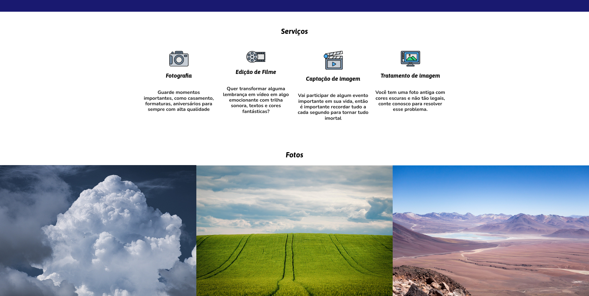

# Website de Fotografia Profissional Responsivo em HTML e CSS

    
    

## Sobre o Projeto
A ideia do website foi para aplicar, práticar e melhorar minhas habilidades técnicas em desenvolvimento web. 

**Acesse no seu navegador clicando aqui**: https://filipirafael.github.io/fotografo-profissional-website/

## Novas versões
Conforme vou adquirindo novas habilidades, irei atualizando o projeto em novas versões. 

## Versão Mobile
Web site responsivo através de CSS Media Queries.